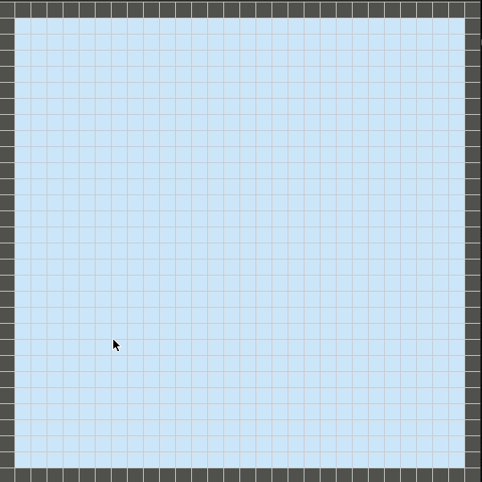
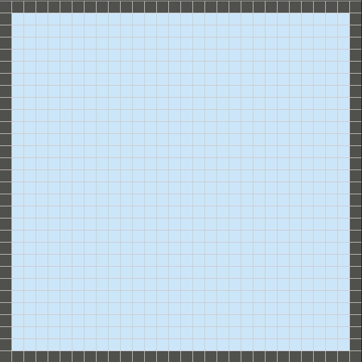

# Path Finding (BFS / A*)
According to Wikipedia:

> Breadth-first search (BFS) is an algorithm for traversing or searching tree or graph data structures. It starts at the tree root and explores all of the neighbor nodes at the present depth prior to moving on to the nodes at the next depth level.

> A* is a graph traversal and path search algorithm, which is often used in many fields of computer science due to its completeness, optimality, and optimal efficiency.

## Prerequisites
You only need to have Python3.x and  Pygame installed on your system.

## How to work with this?
First, when you run the code, you'll be asked to input two numbers and the approach you prefer to search through the map:
1. Number of blocks in each row/column
2. Width/Height of your intended window to be shown

Afterward, the desired window will be popped up. Your two earliest clicks will set the ORIGIN and then TARGET blocks (But if you just miss clicked, don't worry! you can first erase each one you desire by right-clicking and then insert it to the map by left-clicking as many times as you want.
Now it's time to set the obstacles on the map. You can either click on each block or drag on the map much more easily.
After setting everything, to run the pathfinder algorithm you just need to press the `SPACE` key and then you can watch and enjoy the beauty of this algorithm. By the way, to run again on the same map with different obstacles you can press the `BACKSPACE `key without requiring running the program again.

Here is a demo illustrating how it works:

A* approach | BFS approach
:------------------------:|:------------------------:
|
There doesn't exist a way
 |

