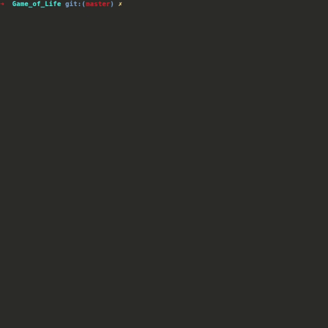

Referring to Wikipedia:
> The game is a zero-player game, meaning that its evolution is determined by its initial state, requiring no further input.

I've implented this game by Python and also added plenty of methods that draw some famous (and also simple!) patterns included:
* Block
* Beacon 
* Glider

Here is an example demonstrating how it works:

