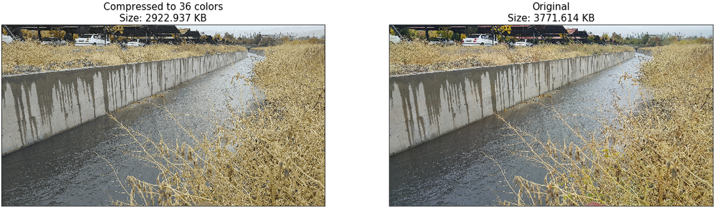
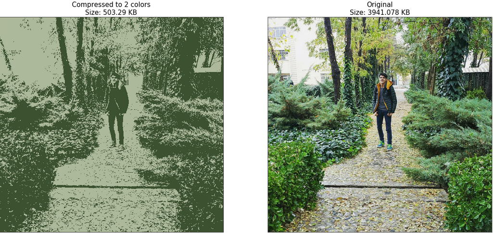

## K-means_Compression
Here you are asked to choose the number of colors you want your input image to be compressed to; then the clustering algorithm appears. Here are some examples:

By the way, there are many other ways to compress images much more efficiently!
