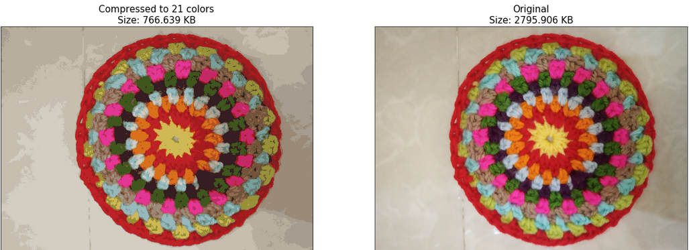
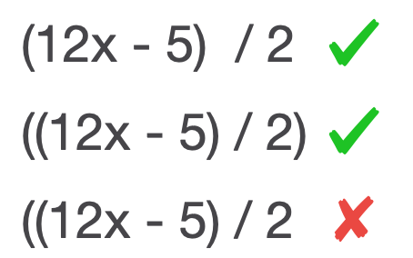
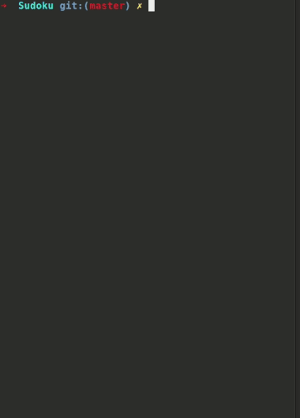

# Cool Random Stuff!

This repository contains every random piece of code that I have found **Cool**! Moreover, it is the result of merging two of my public repositories known as *Cool* and *Algorithms*. Here, you'll find everything from simple multiline scripts to some well-known algorithms such as *Shunting yard* or *Huffman compression* algorithms (mostly from my junior and sophomore years at university). Below, you can find the list of this repo's contents as well as a brief description for each:

* [Game of life](/Game_of_Life/): a `Python` implementation of Conway's Game of Life (read more [here](!https://en.wikipedia.org/wiki/Conway%27s_Game_of_Life))

* [Huffman](/Huffman/): a `Python` implementation of Huffman compression algorithm (read more [here](!https://en.wikipedia.org/wiki/Huffman_coding)) which was done for the *"Design of Algorithms"* course

Image source: <a href=https://en.wikipedia.org/wiki/Huffman_coding>wikipedia.org</a>

* [K-means compression](/K-means_Compression/): here you can choose the intended number of colors appearing in your image (K). Afterward, by performing a `K-means` clustering, K colors (the cluster centroids) are chosen and then all the colors are transformed to those.

* [Parentheses checking](/Parentheses_Checking/): using the **stack** data structure, this `C++` program simply checks if in an arithmetic expression the parentheses match.

* [Path finding](/Path_Finding/): with the help of `Python` and `Pygame`, the two most well-known search algorithms, `A*` and `BFS` are visualized. Users are also able to a little bit customize the map.

A* search | BFS search | No way :/
:---:|:---:|:---:
 |  | 

* [Shunting Yard algorithm](/Shunting_Yard_Algorithm/): a `C++` implementation of the Shunting Yard algorithm which is used for parsing mathematical expressions specified in infix notation.

Image source: <a href=https://en.wikipedia.org/wiki/Shunting_yard_algorithm>wikipedia.org</a>

* [Sudoku solver](/Sudoku/): a Sudoku solver implemented in `Python`. It uses backtracking algorithm to solve the given table (the empty cells are specified with *0*).

